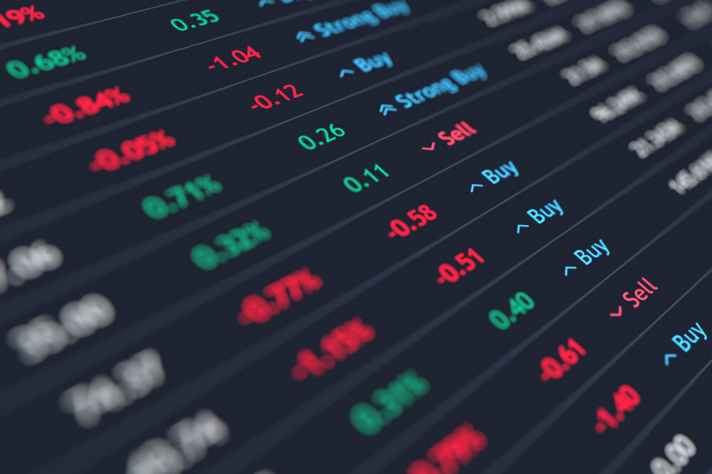
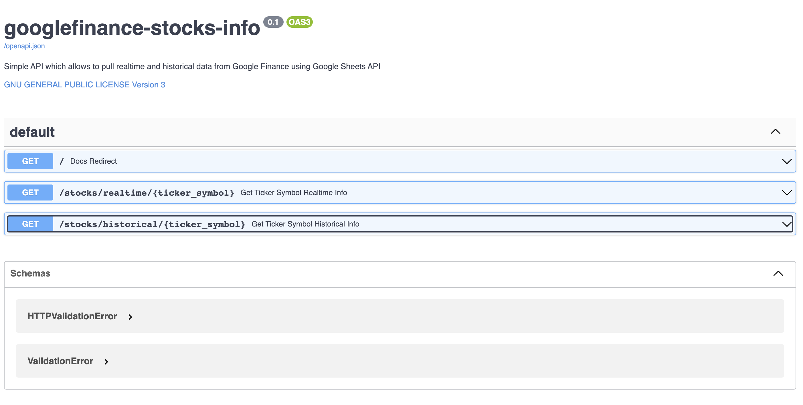
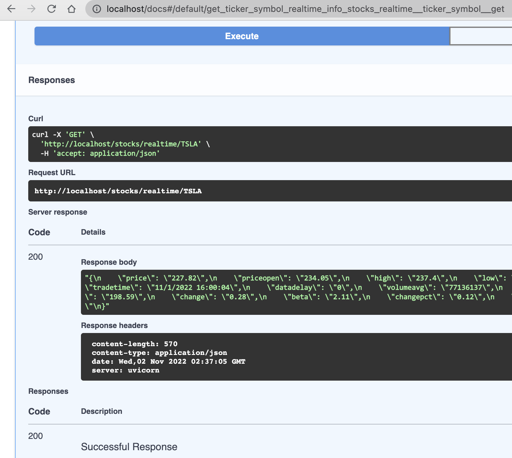

<div align="center">

  
  <h1>Google Finance Stocks Info</h1>
  
  <p>
    Get realtime and historical securities information in JSON format from Google Finance using Python and the Google Sheets and Drive APIs. 
  </p>
</div>

<!-- Table of Contents -->
# Table of Contents
- [About the Project](#about-the-project)
  * [Screenshots](#screenshots)
  * [Tech Stack](#tech-stack)
  * [Features](#features)
- [Usage](#usage)
- [Out of scope](#Out of scope)
- [Acknowledgements](#acknowledgements)

<!-- About the Project -->
## About the Project
Unfortunately the "Google Finance API (both the Portfolio API and the Finance Gadgets and Tools API)" were "<a href="https://groups.google.com/g/google-finance-apis">shut down</a> on October 20, 2012". Realtime and historical data can be retrieved though using the <a href="https://support.google.com/docs/answer/3093281?hl=en">=GOOGLEFINANCE()</a> function directly in Google Sheets.
In a nutshell: this project creates programmatically a spreadsheet and populates the required information using the GOOGLEFINANCE, values are then retrieved and served as a JSON response using FastAPI.

<!-- Screenshots -->
### Screenshots

<div align="center"> 
  
</div>

<!-- TechStack -->
### Tech Stack

<details>
  <ul>
    <li><a href="https://www.python.org/">Python 3</a></li>
    <li><a href="https://fastapi.tiangolo.com/">FastAPI</a></li>
    <li><a href="https://developers.google.com/sheets/api/quickstart/python">Sheets API</a></li>
    <li><a href="https://www.docker.com/">Docker</a></li>
  </ul>
</details>

<!-- Features -->
### Features

- Given a stock symbol for realtime data it retrieves: price, priceopen, high, low, volume, marketcap, tradetime, datadelay, volumeavg, pe, eps, high52, low52, change, beta, changepct, closeyest, shares, and currency information.
- Given a stock symbol for historical data it retrieves: open, close, high, low, and volume information.

<!-- Usage -->
## Usage
1. Clone the <a href="https://github.com/andreihalici/googlefinance-stocks-info">googlefinance-stocks-info</a> repository locally. Once the repository is cloned, create a python virtual environment using the ```python3 -m venv venv``` command and install the required dependencies using the ```make setup``` command.
2. Follow the <a href="https://developers.google.com/sheets/api/quickstart/python">Python quickstart</a> instructions and enable the API, authorize the credentials (use included quickstart.py file), install the Google client libraries and test everything (as previously mentioned) using the quickstart.py file.
3. Once the GCP project is set up correctly for authentification and authorization, install <a href="https://www.docker.com/">Docker</a> and build the docker container using:
the ```make build``` command. To run the freshly built container use the ```make run-container``` command. Alternatively the ```make run-local```  command will start the application (used for development/testing).
4. Navigate to ``` http://localhost``` on port ```80``` and test the API.
  

<!-- Out of scope -->
## Out of scope
While the APIs work as intended for a production ready API please consider adding:

- <a href="https://fastapi.tiangolo.com/deployment/https/">HTTPS</a> support.
- <a href="https://fastapi.tiangolo.com/tutorial/testing/">Testing</a> for existing endpoints.
- Setting up rate limiting and <a href="https://fastapi.tiangolo.com/tutorial/security"> security</a>.
- Setting up logging, monitoring and tracing using your favorite platform/tools.

<!-- Acknowledgements -->
## Acknowledgements
https://www.youtube.com/shorts/BQU_QcxFvzA

